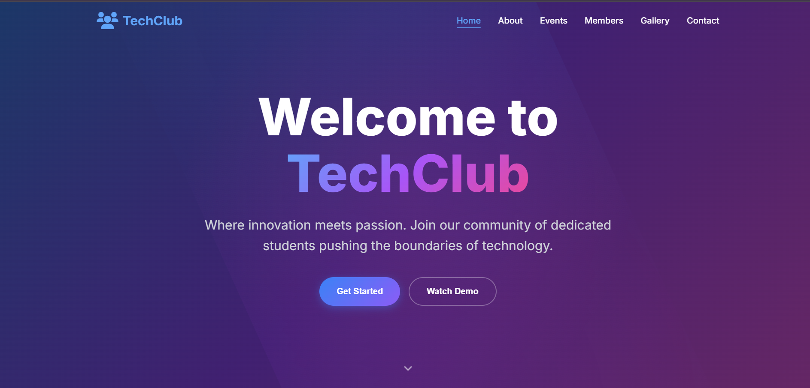

# 🚀 TechClub - College Club Website
### 🧑‍💻 Developed by: **DeenPrasath S**

A modern, fully responsive multi-page website built for a college Tech Club using HTML, CSS, and JavaScript. The website showcases club activities, events, members, gallery, and contact options — with interactive animations and stylish design.

---

## 🔗 Live Demo

👉 **[Click here to view the live project](https://Deenprasath.github.io/college-club-website/)**  

---

## 🌟 Features

- 🎯 Smooth scroll navigation and animated sections
- 💡 About TechClub: story, mission, vision, values
- 📆 Events: upcoming hackathons, workshops, tech talks
- 👥 Members: executive & active team profiles with skills
- 🖼️ Gallery with lightbox viewer for event photos
- 📬 Contact form with validation and interactive effects
- 📱 Fully mobile-responsive design with hamburger menu
- 🎨 Custom gradients, glassmorphism cards, stylish UI

---

## 🛠 Tech Stack

- `HTML5` – Markup and layout
- `CSS3` – Styling, effects, layout, responsiveness
- `Vanilla JavaScript` – DOM manipulation, interactivity, form handling

---

## 📂 Folder Structure
echclub/
├── index.html
├── styles.css
├── script.js
├── college-club-website.png
└── README.md
